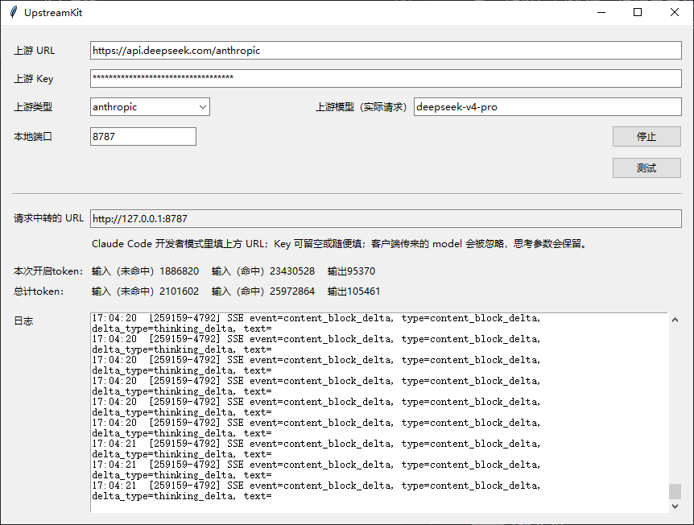
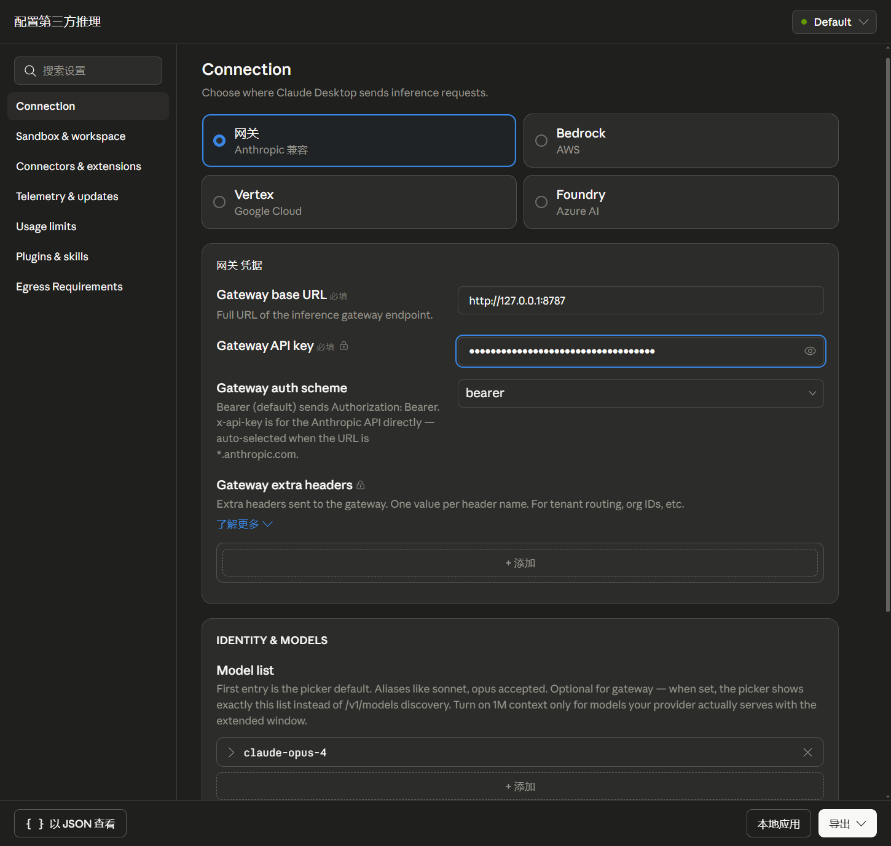

# UpstreamKit

一个 Windows GUI API 中转工具，用于配置上游模型接口、转发请求、记录日志和统计 token。
可用于Claudecode Desktop中转




## 使用

- 输入实际请求的 URL、Key、模型ID
- 选择 Openai or anthropic
- 点击测试  看见200代表成功
- 点击开始  显示本地url和端口
- 在调用处配置url    
- key和模型id随便填
- 开始使用  

## Windows 打包

```powershell
.\build_exe.ps1
```

输出：

```text
dist\UpstreamKit.exe
```

## macOS 打包

macOS 安装包需要在 Mac 上打包，Windows 不能直接生成可用的 `.app/.dmg`。

在 Mac 上执行：

```bash
chmod +x build_mac.sh
./build_mac.sh
```

输出：

```text
dist/UpstreamKit.app
dist/UpstreamKit.dmg
```

macOS 版本运行后，`config.json` 和 `token_stats.json` 会保存在 `UpstreamKit.app` 同级目录。
